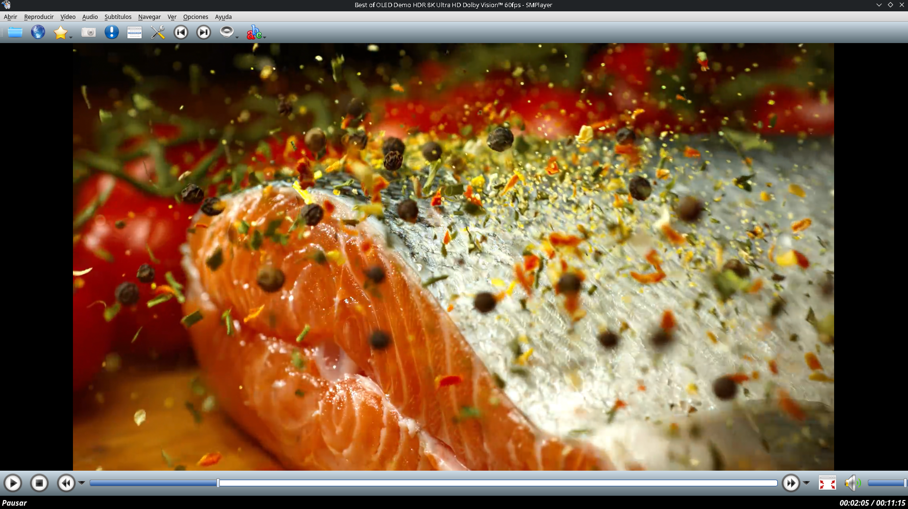
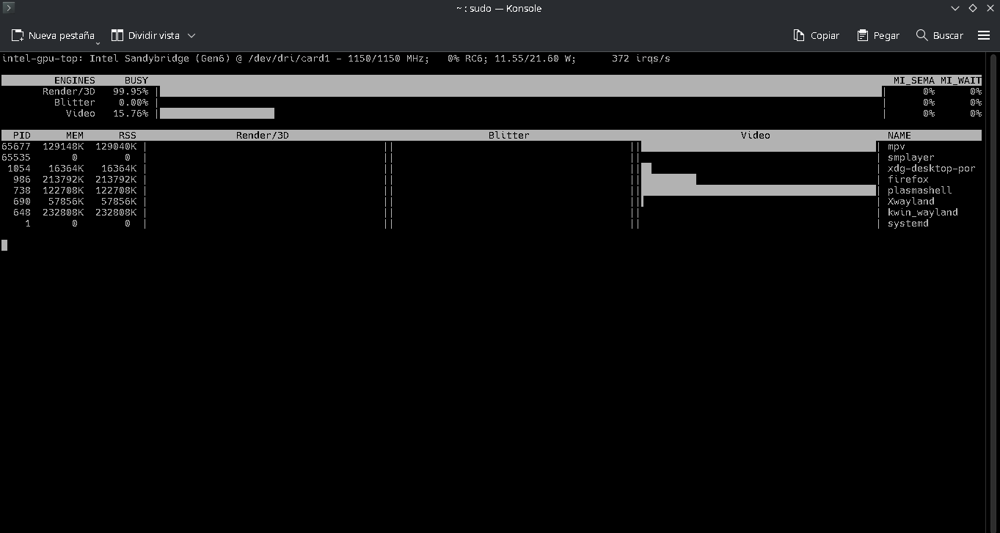

<body>

<h1>SMPlayer AppImage — GPU HW Accelerated 8K 60FPS</h1>

    

    <strong>A portable, hardware-accelerated SMPlayer AppImage for Linux.</strong> 
    Designed around a lightweight and cooperative AppImage architecture that
    uses the host system's multimedia stack whenever possible while providing
    compatible runtime libraries inside the AppImage as a fallback.

<h2>Overview</h2>

This project provides a custom portable build of
<strong>SMPlayer</strong> packaged as an AppImage and optimized for
hardware-accelerated video playback.

The goal is simple: keep the application portable without turning the
AppImage into an entire operating system. The application can use compatible
libraries provided by the host system, while bundled libraries are available
inside the AppImage when required.

This approach is particularly useful on Arch Linux, CachyOS, Manjaro and
other modern Linux distributions, while still providing a reasonable chance
of compatibility with other distributions.

    <strong>Hardware acceleration verified.</strong>
    Playback has been tested with high-resolution H.264/AVC material,
    including 1080p, 4K and high-frame-rate video.

<h2>Highlights</h2>

<ul>
    <li>Portable AppImage — no system-wide installation required.</li>
    <li>GPU hardware video decoding through the host multimedia stack.</li>
    <li>4K 30 FPS playback tested.</li>
    <li>4K 60 FPS playback tested.</li>
    <li>High-resolution video playback including 8K testing.</li>
    <li>H.264 / AVC hardware decoding.</li>
    <li>Subtitles and translations supported.</li>
    <li>YouTube playback through yt-dlp.</li>
    <li>M3U / M3U8 playlist playback tested.</li>
    <li>IPTV playback tested with HD channels.</li>
    <li>Cooperative runtime design.</li>
    <li>Minimal AppDir layout.</li>
</ul>

<h2>SMPlayer Running High-Resolution Video</h2>

    
    

        SMPlayer playing high-resolution video with hardware acceleration.
    

<h2>GPU Hardware Acceleration Verification</h2>

Hardware acceleration can be monitored using the appropriate GPU monitoring
tools. For Intel graphics, <code>intel_gpu_top</code> can be used to verify
activity in the video engine during playback.

    
    

        Intel GPU Top showing GPU activity during hardware-accelerated playback.
    

<h2>Cooperative AppImage Architecture</h2>

This AppImage follows a <strong>cooperative runtime philosophy</strong>.
Instead of attempting to bundle an entire Linux userspace, it provides the
application and the libraries required for portability while allowing the
host system to provide compatible components when appropriate.

This is especially important for graphics and multimedia components.
Hardware acceleration depends heavily on the host kernel, GPU drivers,
VA-API/VDPAU stack and related system components.

The AppImage therefore does <strong>not</strong> attempt to replace the host
GPU driver stack.

    <strong>Important:</strong>
    GPU drivers remain provided by the host operating system. The AppImage
    does not contain proprietary GPU drivers.

<h2>Runtime Libraries</h2>

The AppImage contains a minimal set of runtime libraries required by the
application. These include compatible Qt5 components and other runtime
dependencies required for the portable build.

The runtime is intentionally kept small. Unnecessary development packages,
compilers, debugging tools and duplicated system components are not included.

Depending on the distribution and its library versions, the host system may
provide a compatible version of a library while the AppImage provides a
fallback copy.

<h2>System Requirements</h2>

The recommended environment contains the following multimedia components:

<ul>
    <li><strong>MPV</strong></li>
    <li><strong>FFmpeg</strong></li>
    <li><strong>Qt5 / compatible Qt runtime</strong></li>
    <li><strong>GPU drivers supporting hardware video decoding</strong></li>
</ul>

The AppImage already contains several runtime components required for
portability. However, using the host versions may be preferable when they
are compatible with the system's optimized multimedia stack.

<h3>Arch Linux / CachyOS / Manjaro</h3>

<pre><code>sudo pacman -S mpv ffmpeg qt5-base</code></pre>

<h3>Debian / Ubuntu</h3>

<pre><code>sudo apt install mpv ffmpeg</code></pre>

<h3>Fedora</h3>

<pre><code>sudo dnf install mpv ffmpeg</code></pre>

    <strong>Note:</strong>
    Package names can differ between distributions. The AppImage is intended
    to remain portable, but multimedia hardware acceleration ultimately
    depends on the host system's GPU driver and multimedia stack.

<h2>Hardware Acceleration</h2>

Hardware decoding is strongly recommended for high-resolution video.
Without hardware acceleration, 4K and especially 8K playback can place a
very large load on the CPU.

For Intel GPUs, VA-API support can be checked with:

<pre><code>sudo pacman -S libva-utils
vainfo</code></pre>

Intel GPU activity can be monitored with:

<pre><code>sudo pacman -S intel-gpu-tools
intel_gpu_top</code></pre>

During hardware-accelerated playback, the GPU video engine should show
activity.

<h2>Portable Path Fix</h2>

The original SMPlayer source contains installation-path assumptions that
normally expect resources to be installed into fixed system locations.

This project modifies the path handling so that resources can be discovered
relative to the portable application layout.

<h3>Modified Source File</h3>

The primary portability modification is located in:

<pre><code>src/paths.cpp</code></pre>

The following implementation makes the application locate its shared data
relative to the executable:

<pre><code>QString Paths::dataPath() {
    return QDir(appPath()).absoluteFilePath("../share/smplayer");
}

QString Paths::translationPath() {
    return dataPath() + "/translations";
}

QString Paths::docPath() {
    return dataPath() + "/docs";
}

QString Paths::themesPath() {
    return dataPath() + "/themes";
}</code></pre>

<h2>Fallback Data Path</h2>

The final implementation also supports a fallback mechanism. If the portable
data directory exists, it is preferred. Otherwise, the original compiled
path can still be used when available.

<pre><code>QString Paths::dataPath() {
    QString appData =
        QDir(appPath()).absoluteFilePath("../share/smplayer");

    if (QDir(appData).exists()) {
        return appData;
    }

#ifdef DATA_PATH
    QString path = QString(DATA_PATH);

    if (!path.isEmpty()) {
        return path;
    }
#endif

    return appPath();
}</code></pre>

<h2>Build Configuration</h2>

The fixed installation-path definitions were removed from the build
configuration so that the runtime path logic can determine the correct
location dynamically.

In <code>src/smplayer.pro</code>, the following definitions are disabled:

<pre><code>#DEFINES += DATA_PATH=$(DATA_PATH)
#DEFINES += DOC_PATH=$(DOC_PATH)
#DEFINES += TRANSLATION_PATH=$(TRANSLATION_PATH)
#DEFINES += THEMES_PATH=$(THEMES_PATH)
#DEFINES += SHORTCUTS_PATH=$(SHORTCUTS_PATH)</code></pre>

<h2>Portable Resource Layout</h2>

The intended AppImage structure follows the standard Linux filesystem
layout:

<pre><code>AppDir/
├── AppRun
├── smplayer.desktop
├── smplayer.svg
└── usr/
    ├── bin/
    │   └── smplayer
    ├── lib/
    │   └── Qt5 runtime libraries
    └── share/
        └── smplayer/
            ├── translations/
            ├── themes/
            ├── shortcuts/
            └── docs/</code></pre>

Keeping resources under <code>usr/share/smplayer</code> preserves the normal
Linux filesystem organization while allowing the application to operate from
inside an AppImage.

<h2>Translations</h2>

SMPlayer translations are included in the portable resource tree and are
loaded relative to the application's portable data path.

This avoids depending exclusively on a fixed system installation such as:

<pre><code>/usr/share/smplayer</code></pre>

The portable application instead resolves its resources relative to the
AppImage filesystem.

<h2>YouTube Playback</h2>

The application can use <strong>yt-dlp</strong> for online video playback.
The portable environment can maintain its own user-local yt-dlp installation
without requiring a system-wide installation.

This allows SMPlayer to access online video services while keeping the main
application portable.

<h2>M3U / M3U8 and IPTV</h2>

Playlist playback has also been tested with M3U and M3U8 sources.

HD IPTV channels were successfully tested through SMPlayer, demonstrating
that the portable build can also function as a lightweight media player for
network streams.

<h2>Optimization Philosophy</h2>

This project intentionally avoids bundling unnecessary components.

<ul>
    <li>Unused development files removed.</li>
    <li>Unnecessary debugging components removed.</li>
    <li>Redundant runtime files removed.</li>
    <li>Unused Qt components removed where possible.</li>
    <li>Runtime binaries stripped.</li>
    <li>Only required Qt libraries retained.</li>
    <li>System GPU drivers are not bundled.</li>
    <li>Host multimedia components can be used when compatible.</li>
</ul>

The objective is not to create a miniature Linux distribution inside an
AppImage. The objective is to provide a practical portable application with
the smallest reasonable runtime footprint.

<h2>Why Hardware Acceleration Matters</h2>

High-resolution video can be extremely demanding when decoded entirely by
the CPU. Hardware decoding moves the appropriate video decoding workload to
the GPU, significantly reducing CPU utilization.

This is particularly interesting for older GPUs that still contain dedicated
video decoding hardware capable of efficiently decoding formats such as
H.264/AVC.

The project therefore focuses on using the hardware capabilities already
present in the host system rather than replacing them with bundled drivers.

<h2>Project Philosophy</h2>

<strong>Portable does not have to mean bloated.</strong>

This project follows a cooperative approach:

<ul>
    <li>Bundle what the application genuinely needs.</li>
    <li>Use compatible host libraries whenever appropriate.</li>
    <li>Keep GPU drivers in the host system.</li>
    <li>Avoid duplicating the entire operating system inside the AppImage.</li>
    <li>Keep the application easy to copy, execute and remove.</li>
</ul>

The result is a lightweight AppImage designed to behave like a portable
Linux application rather than a complete userspace distribution.

<h2>Source Code Modifications</h2>

This repository includes the modified source files used for the portability
work:

<pre><code>src mod/
├── LEEME.MD
├── paths.cpp
└── smplayer.pro</code></pre>

The modifications are intentionally small and focused primarily on resource
path discovery and portable filesystem layout.

<h2>Testing</h2>

The build has been tested with:

<ul>
    <li>H.264 / AVC video</li>
    <li>1080p video</li>
    <li>1080p 60 FPS</li>
    <li>4K 30 FPS</li>
    <li>4K 60 FPS</li>
    <li>High-resolution 8K testing</li>
    <li>Hardware-accelerated playback</li>
    <li>Subtitles</li>
    <li>SMPlayer translations</li>
    <li>YouTube playback through yt-dlp</li>
    <li>M3U playlists</li>
    <li>M3U8/network streams</li>
    <li>HD IPTV channels</li>
</ul>

<h2>Disclaimer</h2>

Hardware acceleration depends on the capabilities and configuration of the
host GPU, kernel, drivers and multimedia libraries. Successful playback on
one system does not guarantee identical results on every Linux distribution.

Bundled libraries are provided for portability, but distribution-specific
optimizations and library versions can affect runtime behavior.

<h2>License</h2>

SMPlayer remains licensed under its original open-source license.

This repository contains the AppImage/AppDir packaging work, portability
modifications, documentation and related helper files.

</body>
</html>
